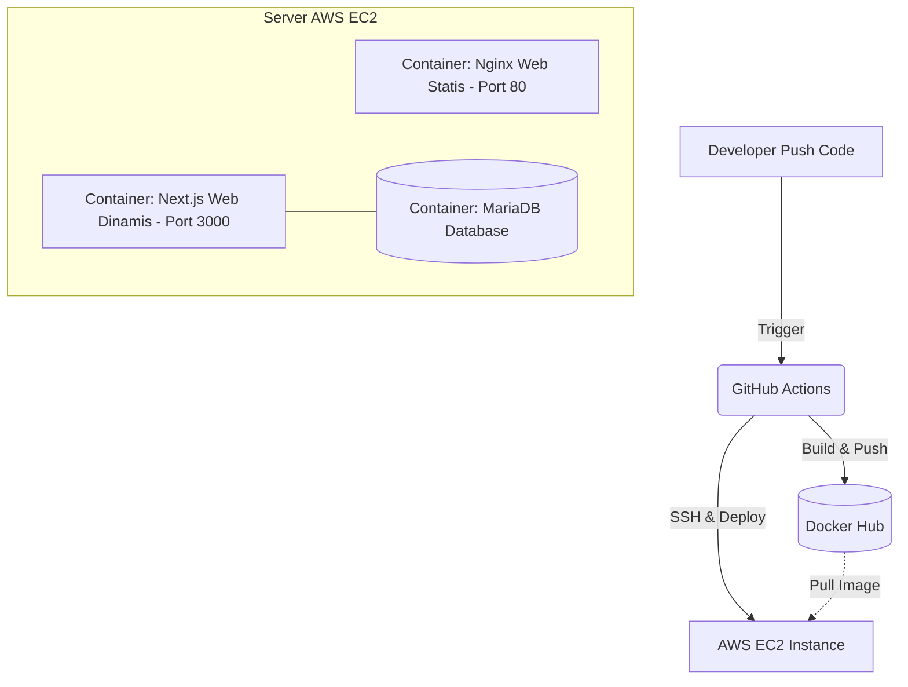
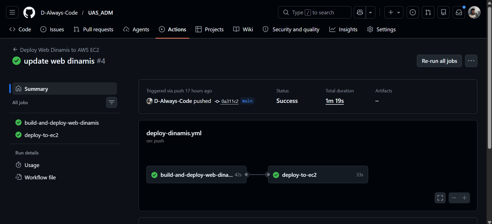
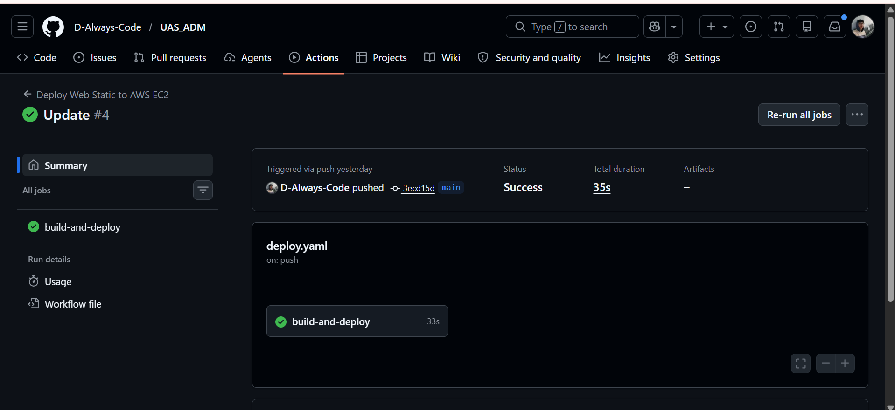
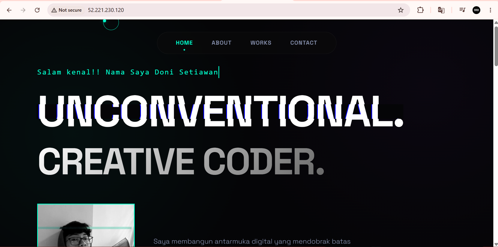

# UAS Administrasi Server - Doni Setiawan

Repositori ini berisi keseluruhan source code untuk Ujian Akhir Semester (UAS) mata kuliah Administrasi Server. Terdiri dari dua jenis layanan web (Statis dan Dinamis) yang di-deploy ke AWS EC2 menggunakan Docker dan CI/CD dari GitHub Actions.

## Tautan Akses Langsung (AWS EC2)

Aplikasi telah berhasil di-deploy ke server cloud AWS EC2 dan dapat diakses publik melalui tautan berikut:

- ** Web Statis (Port 80):** [http://52.221.230.120/](http://52.221.230.120)
- ** Web Dinamis (Port 3000):** [http://52.221.230.120:3000](http://52.221.230.120:3000)

---

##  Topologi Arsitektur

Arsitektur aplikasi ini menggunakan pendekatan *containerization* dan CI/CD otomatis, dengan alur kerja (pipeline) sebagai berikut:

1. **Developer / Local:** Push kode (Statis / Dinamis) ke branch `main` di repositori GitHub.
2. **GitHub Actions (CI/CD):** 
   - Mendeteksi perubahan pada direktori spesifik.
   - Melakukan *Build* Docker Image (Nginx untuk statis, Next.js untuk dinamis).
   - Melakukan *Push* image ke **Docker Hub** dengan tag yang dipisah (`donisetiawan25/uas-doni:statis` & `donisetiawan25/uas-doni:latest`).
3. **AWS EC2 (Production Server):** 
   - GitHub Actions melakukan koneksi SSH otomatis ke EC2.
   - Menjalankan `docker compose pull` untuk mengunduh image terbaru dari Docker Hub.
   - Menjalankan `docker compose up -d` untuk menghidupkan container (Nginx, Next.js, dan MariaDB) secara otomatis.

---

##  Penjelasan Environment & Secrets

Agar sistem dan CI/CD dapat berjalan sempurna, repositori ini sangat bergantung pada variabel lingkungan (Environment Variables) berikut:

### 1. GitHub Secrets (Konfigurasi CI/CD)
Digunakan oleh GitHub Actions untuk mendapatkan hak akses ke server EC2 dan Docker Hub.
- `AWS_HOST`: Public IP address dari EC2 (`52.221.230.120`).
- `AWS_USERNAME`: User login server EC2 (`ubuntu`).
- `AWS_PRIVATE_KEY`: Private Key (`.pem`) untuk masuk koneksi SSH.
- `DOCKERHUB_USERNAME`: Username akun Docker Hub.
- `DOCKERHUB_TOKEN`: Access token aman untuk Docker Hub.

### 2. Environment Variables (Koneksi Database Dinamis)
Digunakan oleh aplikasi Next.js dan MariaDB di dalam `docker-compose.yml` agar saling terhubung di satu jaringan Docker.
- `DB_HOST`: `db-webdinamis` (Menggunakan nama *service* Docker alih-alih localhost).
- `DB_USER`: `uas_doni_2388010045`
- `DB_PASSWORD`: `Setiawan5525!`
- `DB_NAME`: `uas_adm_doni`
- `NEXTAUTH_URL`: `http://52.221.230.120:3000` (Alamat utama autentikasi web).

---

##  Bukti Deploy Sukses (GitHub Actions)

Berikut adalah bukti dokumentasi bahwa keseluruhan alur CI/CD dari proses *build image* hingga eksekusi instalasi di server EC2 telah berjalan dengan sukses tanpa error (Indikator Hijau):

